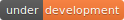

# Overview 

Stock Trading using a Reinforcement Learning algorithm called Deep Q-Learning

## Dataset

You can download Historical Financial Data from  into `data/` directory for training and testing.

## Getting Started

In order to train the model and make predictions, you will need to install the required python packages:

`pip install -r requirements.txt`

Now you can open up a terminal and start training the model where you need to provide training data, validation data, n-day window size, batch size, episode count, model name and whether you want to train a pretrained model or train a new one:

`python train.py GOOGL GOOGL_2017 10 32 100 model_GOOGL 0`

Once you're done training, run the evaluation script which will load the pretrained model if you provide one or evaluate all models in `models/` directory, you also need to provide the window size you used to train the pretrained model:

`python evaluate.py GOOGL_2018 10 model_GOOGL`

Now you are all set up!

## Results

Training:

```
number of training examples = 1760
```

```
Episode 4/100: 100%|##################################################################| 1760/1760 [00:23<00:00, 73.49it/s] 
Episode 4/100 - Train Position: +$1049.67  Val Position: +$622.05  Train Loss: 0.7369  (~23.9497 secs)

Episode 5/100: 100%|##################################################################| 1760/1760 [00:23<00:00, 74.33it/s] 
Episode 5/100 - Train Position: +$453.17  Val Position: +$465.97  Train Loss: 0.5411  (~23.6792 secs)

Episode 6/100: 100%|##################################################################| 1760/1760 [00:22<00:00, 79.04it/s] 
Episode 6/100 - Train Position: +$781.33  Val Position: +$1930.88  Train Loss: 0.5208  (~22.2692 secs)
```

Evaluating:

```
number of test examples = 252
```

```
model_GOOGL: 100%|################################################################| 252/252[00:00<00:00, 2492.01it/s]
Final Position: +$4868.04
```

Model Parameters:

```
Total params: 7,659
Trainable params: 7,659
Non-trainable params: 0
```

## Built With

* Python
* Keras
* TensorFlow
* NumPy
* tqdm

## Authors

Prabhsimran Singh

## License

This project is licensed under the MIT License - see the LICENSE.md file for details